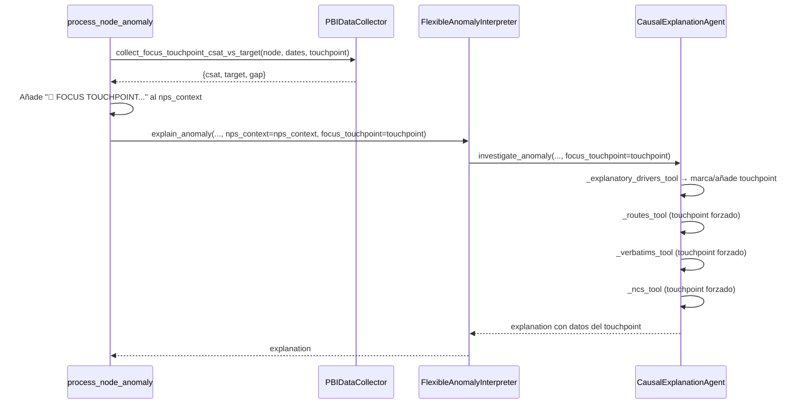

# Documento de Diseño: focus-touchpoint

## Visión General

La feature `focus-touchpoint` añade un parámetro opcional `--focus-touchpoint` al sistema de análisis de NPS de Iberia. Cuando se especifica, el sistema investiga ese touchpoint en profundidad en dos momentos clave del flujo:

1. **Al construir el `nps_context`** (antes de que el agente arranque): se añade el CSAT actual del touchpoint y su gap vs target.
2. **En `_explanatory_drivers_tool`**: se fuerza la presencia del touchpoint en los drivers con sus métricas, y se garantiza su investigación con `routes_tool`, `verbatims_tool` y `ncs_tool`.

El parámetro se propaga por toda la cadena de llamadas sin romper la interfaz existente (parámetro opcional con valor por defecto `None`).

---

## Arquitectura

### Flujo de propagación del parámetro

```
CLI --focus-touchpoint ifl_100_cabin_crew
  └─► main() [deep_research_period.py]
        └─► execute_analysis_flow(focus_touchpoint=...)
              └─► show_all_anomaly_periods_with_explanations(focus_touchpoint=...)
                    └─► process_single_period(focus_touchpoint=...)
                          ├─► process_node_anomaly(...)
                          │     ├─► PBIDataCollector.collect_focus_touchpoint_csat_vs_target(...)
                          │     │     → Añade línea 🎯 al nps_context
                          │     └─► FlexibleAnomalyInterpreter(focus_touchpoint=...)
                          │           └─► CausalExplanationAgent(focus_touchpoint=...)
                          │                 ├─► _explanatory_drivers_tool: marca/añade touchpoint
                          │                 └─► routes/verbatims/ncs: investiga obligatoriamente
                          └─► AnomalyInterpreterAgent: prompt enriquecido
        └─► AnomalySummaryAgent: sección dedicada en resumen

CLI weekly_deep_research.py --focus-touchpoint ifl_100_cabin_crew
  └─► main() [weekly_deep_research.py]
        └─► run_weekly_comprehensive_analysis(focus_touchpoint=...)
              └─► execute_analysis_flow(focus_touchpoint=...) [×2: weekly + daily]
```

### Diagrama de secuencia (por nodo/periodo)



---

## Componentes e Interfaces

### 1. `deep_research_period.py` — Cambios en firmas

**`execute_analysis_flow`** — añadir parámetro:
```python
async def execute_analysis_flow(
    ...,
    focus_touchpoint: Optional[str] = None,
) -> str:
```

**`show_all_anomaly_periods_with_explanations`** — añadir parámetro:
```python
async def show_all_anomaly_periods_with_explanations(
    ...,
    focus_touchpoint: Optional[str] = None,
):
```

**`process_single_period`** — añadir parámetro:
```python
async def process_single_period(
    ...,
    focus_touchpoint: Optional[str] = None,
) -> dict:
```

**`process_node_anomaly`** (función interna anidada) — captura `focus_touchpoint` del closure y:
- Llama a `PBIDataCollector.collect_focus_touchpoint_csat_vs_target(...)` si `focus_touchpoint` está activo.
- Añade la línea `🎯 FOCUS TOUCHPOINT...` al `nps_context`.
- Pasa `focus_touchpoint` a `FlexibleAnomalyInterpreter`.

**`main()`** — añadir argumento CLI:
```python
parser.add_argument(
    '--focus-touchpoint',
    type=str,
    default=None,
    help='Touchpoint a investigar en profundidad (filtered_name, p.ej. ifl_100_cabin_crew)'
)
```

### 2. `weekly_deep_research.py` — Cambios en firmas

**`run_weekly_comprehensive_analysis`** — añadir parámetro:
```python
async def run_weekly_comprehensive_analysis(
    ...,
    focus_touchpoint: Optional[str] = None,
):
```
Propaga `focus_touchpoint` a ambas llamadas a `execute_analysis_flow` (weekly y daily).

**`main()`** — añadir argumento CLI:
```python
parser.add_argument(
    '--focus-touchpoint',
    type=str,
    default=None,
    help='Touchpoint a investigar en profundidad (filtered_name, p.ej. ifl_100_cabin_crew)'
)
```

### 3. `FlexibleAnomalyInterpreter` — Cambios

**`__init__`** — añadir parámetro:
```python
def __init__(self, ..., focus_touchpoint: Optional[str] = None):
    ...
    self.focus_touchpoint = focus_touchpoint
```

**`explain_anomaly`** — añadir parámetro y propagación:
```python
async def explain_anomaly(self, ..., focus_touchpoint: Optional[str] = None) -> str:
    ...
    # Al inicializar/reinicializar el causal_agent, pasar focus_touchpoint
    self.causal_agent = CausalExplanationAgent(..., focus_touchpoint=focus_touchpoint or self.focus_touchpoint)
```

### 4. `CausalExplanationAgent` — Cambios

**`__init__`** — añadir parámetro:
```python
def __init__(self, ..., focus_touchpoint: Optional[str] = None):
    ...
    self.focus_touchpoint = focus_touchpoint
```

**`investigate_anomaly`** — añadir parámetro:
```python
async def investigate_anomaly(self, ..., focus_touchpoint: Optional[str] = None) -> str:
    # Usar focus_touchpoint o self.focus_touchpoint
    effective_focus = focus_touchpoint or self.focus_touchpoint
```

**`_explanatory_drivers_tool`** — lógica de forzado (ver sección Lógica de Negocio).

**`_collect_focus_touchpoint_data`** (nueva función privada) — ejecuta la query adicional sin filtro `explanatory_drivers`.

### 5. `PBIDataCollector` — Nuevas funciones

```python
# Diccionario de mapeo filtered_name → display_name para Issue_touchpoint_Dict
TOUCHPOINT_DISPLAY_NAME_MAP: Dict[str, str] = {
    "ifl_100_cabin_crew_satisfaction": "Cabin Crew",
    "ifl_200_food": "Food & Beverage",
    # ... extensible sin cambios de código
}

def get_touchpoint_display_name(filtered_name: str) -> Optional[str]:
    """Devuelve el display_name para usar en queries de issues, o None si no existe mapeo."""
    return TOUCHPOINT_DISPLAY_NAME_MAP.get(filtered_name)

async def collect_focus_touchpoint_csat_vs_target(
    self,
    node_path: str,
    start_date: datetime,
    end_date: datetime,
    touchpoint_name: str,          # filtered_name (p.ej. "ifl_100_cabin_crew_satisfaction")
    comparison_filter: Optional[str] = None,
    comparison_start_date: Optional[datetime] = None,
    comparison_end_date: Optional[datetime] = None,
) -> Optional[Dict[str, float]]:
    """
    Recoge CSAT actual y Target_Satisfaction_filtered para un touchpoint específico.
    touchpoint_name es el filtered_name tal como aparece en TouchPoint_Master.
    Devuelve dict con keys: 'csat', 'target', 'gap', 'satisfaction_diff', 'shapdiff'
    o None si no hay datos.
    """

async def collect_focus_touchpoint_issues_pct(
    self,
    node_path: str,
    start_date: datetime,
    end_date: datetime,
    comparison_start_date: datetime,
    comparison_end_date: datetime,
    touchpoint_display_name: str,  # display_name en Issue_touchpoint_Dict (p.ej. "Cabin Crew")
) -> Optional[Dict[str, float]]:
    """
    Recoge el % de issues del touchpoint (filtrado por issue_type_3 = touchpoint_display_name)
    para el periodo actual y el comparativo.
    touchpoint_display_name es el nombre en Issue_touchpoint_Dict, obtenido via get_touchpoint_display_name().
    Devuelve dict con keys: 'pct_issues_current' (L7D), 'pct_issues_prev' (L7D_prev), 'diff'
    o None si no hay datos o falla la query.
    """
```

### 6. Prompts YAML — Cambios

**`anomaly_interpreter.yaml`** — añadir instrucciones en `comparative_prompts.system_prompt` y `single_prompts.system_prompt`:
```yaml
# Añadir al final del system_prompt de cada modo:
focus_touchpoint_instructions: >
  FOCUS TOUCHPOINT: Si en los datos de entrada aparece una línea con "🎯 FOCUS TOUCHPOINT",
  debes mencionar ese touchpoint explícitamente en la síntesis ejecutiva con sus métricas
  (CSAT actual, gap vs target, variación vs periodo anterior si disponible).
  Analiza ese touchpoint aunque su SHAP sea bajo o neutro.
```

**`anomaly_summary.yaml`** — añadir instrucciones en `step3_extract_synthesis` y `step4_generate_adaptive_card` para las tres nuevas secciones obligatorias cuando `focus_touchpoint` está activo:
```yaml
# Sección 1 — CSAT por segmento:
focus_touchpoint_csat_section: >
  Si en los datos de entrada aparece información de un FOCUS TOUCHPOINT (marcado con 🎯),
  incluye para cada segmento relevante (Global, LH, SH según aplique) una subsección con:
  - CSAT actual del focus touchpoint en ese segmento
  - Comparación vs periodo comparativo (satisfaction diff), si modo comparative
  - Gap vs target (CSAT - Target)

# Sección 2 — Verbatims de crews por segmento:
focus_touchpoint_crew_verbatims_section: >
  Para cada segmento relevante donde se hayan recogido verbatims de crews del focus touchpoint,
  incluye una subsección con:
  - Resumen general de los verbatims de crews
  - Top verbatims de sentimiento positivo
  - Top verbatims de sentimiento negativo
  Si no hay verbatims de crews para un segmento, indicarlo explícitamente.

# Sección 3 — % Issues de crews por segmento:
focus_touchpoint_crew_issues_section: >
  Para cada segmento relevante donde se haya ejecutado la query de % issues de crews,
  incluye una subsección con:
  - Pct_Issues del periodo actual (L7D)
  - Variación vs periodo comparativo (L7D_prev)
  Si no hay datos de % issues para un segmento, indicarlo explícitamente.
```

---

## Modelos de Datos

### Resultado de `collect_focus_touchpoint_csat_vs_target`

```python
{
    "csat": 72.3,           # Satisfaction actual (float)
    "target": 76.5,         # Target_Satisfaction_filtered (float)
    "gap": -4.2,            # csat - target (float)
    "satisfaction_diff": -1.8,  # Satisfaction diff vs periodo comparación (float, None en single)
    "shapdiff": -0.3        # Shapdiff / SHAP value (float, puede ser None)
}
```

### Resultado de `collect_crew_issues_pct`

```python
{
    "pct_issues_current": 0.142,   # Pct_Issues periodo actual L7D (float, p.ej. 14.2%)
    "pct_issues_prev": 0.118,      # Pct_Issues periodo comparativo L7D_prev (float)
    "diff": 0.024                  # pct_issues_current - pct_issues_prev (float)
}
```

### Línea añadida al `nps_context`

```
🎯 FOCUS TOUCHPOINT 'ifl_100_cabin_crew': CSAT=72.3, vs Target=-4.2pts
```

### Entrada del touchpoint forzado en `_explanatory_drivers_tool`

Cuando el touchpoint NO aparece en los resultados normales, se añade una fila sintética al DataFrame de drivers:

```python
{
    "filtered_name": "🎯 FOCUS: ifl_100_cabin_crew",
    "Satisfaction diff": -1.8,
    "Satisfaction": 72.3,
    "Shapdiff": -0.3,
    "NPS diff": None,
    "is_focus": True
}
```

---

## Query DAX para CSAT vs Target del Touchpoint

La nueva query es una variante de `Exp. Drivers.txt` con tres modificaciones:

1. **Eliminar** `__DS0FilterTable5` (filtro `explanatory_drivers = 1`).
2. **Añadir** filtro por `filtered_name = '__TOUCHPOINT_NAME__'`.
3. **Añadir** `"Target Satisfaction", 'Measure'[Target_Satisfaction_filtered]` en el `SUMMARIZECOLUMNS`.
4. **En modo single**: eliminar también `__DS0FilterTable7` (filtro de comparativa).

```dax
DEFINE  
    VAR __DS0FilterTable =
        TREATAS(__CABIN_FILTER__, 'Cabin_Master'[Cabin_Show])

    VAR __DS0FilterTable2 =
        TREATAS(__COMPANY_FILTER__, 'Company_Master'[Company])

    VAR __DS0FilterTable3 =
        TREATAS(__HAUL_FILTER__, 'Haul_Master'[Haul_Aggr])

    VAR __DS0FilterTable4 =
        FILTER(
            KEEPFILTERS(VALUES('Date_Master'[Date])),   
            AND(
                'Date_Master'[Date] >= DATE(__START_DATE__),
                'Date_Master'[Date] <= DATE(__END_DATE__)
            )
        )

    -- SIN __DS0FilterTable5 (sin filtro explanatory_drivers = 1)

    VAR __DS0FilterTable6 =
        TREATAS({"__TOUCHPOINT_NAME__"}, 'TouchPoint_Master'[filtered_name])

    -- __DS0FilterTable7 solo en modo comparative:
    VAR __DS0FilterTable7 =
        TREATAS({"__COMPARISON_FILTER__"}, 'Filtro_Comparativa'[Filtro_Comparativa])

    VAR __DS0Core =
        SUMMARIZECOLUMNS(
            'TouchPoint_Master'[filtered_name],
            __DS0FilterTable,
            __DS0FilterTable2,
            __DS0FilterTable3,
            __DS0FilterTable4,
            __DS0FilterTable6,
            __DS0FilterTable7,   -- omitir en modo single
            "Satisfaction diff", 'Measure'[S_client_satisfaction_diff],
            "Satisfaction", 'Measure'[S_Satisfaction_label],
            "Target Satisfaction", 'Measure'[Target_Satisfaction_filtered],
            "Shapdiff", 'Measure'[S_shap_value_label_2],
            "NPS diff", [Switch_NPS_Raw_diff]
        )

EVALUATE
    __DS0Core 
```

Esta query se almacena como template en `PBIDataCollector` (no como fichero `.txt` separado, sino como string constante en el método `collect_focus_touchpoint_csat_vs_target`).

---

## Query DAX para % Issues del Focus Touchpoint vs L7D

La nueva query obtiene el porcentaje de pasajeros afectados por issues del focus touchpoint para el periodo actual y el comparativo. Se parametriza por fechas, segmento (cabina/haul/compañía) y `touchpoint_display_name` (el nombre del touchpoint en `Issue_touchpoint_Dict`, obtenido via `get_touchpoint_display_name()`).

**Nota sobre nombres**: el `filtered_name` en `TouchPoint_Master` (p.ej. `ifl_100_cabin_crew_satisfaction`) es distinto del nombre en `Issue_touchpoint_Dict` (p.ej. `Cabin Crew`). La función `get_touchpoint_display_name()` resuelve esta traducción antes de construir la query.

```dax
EVALUATE
VAR _end        = DATE(__END_YEAR__, __END_MONTH__, __END_DAY__)
VAR _start      = DATE(__START_YEAR__, __START_MONTH__, __START_DAY__)
VAR _start_prev = DATE(__START_PREV_YEAR__, __START_PREV_MONTH__, __START_PREV_DAY__)
VAR _end_prev   = DATE(__END_PREV_YEAR__, __END_PREV_MONTH__, __END_PREV_DAY__)

VAR _dateL7D   = FILTER(ALL(Date_Master), Date_Master[Date] >= _start      && Date_Master[Date] <= _end)
VAR _datePrev  = FILTER(ALL(Date_Master), Date_Master[Date] >= _start_prev && Date_Master[Date] <= _end_prev)

RETURN
UNION(
    ROW("Period", "L7D",
        "Pct_Issues", CALCULATE([Switch_%_Affected_D&G],
            _dateL7D,
            __CABIN_FILTER__,
            __HAUL_FILTER__,
            __COMPANY_FILTER__,
            TREATAS({1}, Issue_touchpoint_Dict[explanatory_drivers]),
            FILTER(ALL(Issue_touchpoint_Dict), Issue_touchpoint_Dict[issue_type_3] = "__TOUCHPOINT_DISPLAY_NAME__")
        )
    ),
    ROW("Period", "L7D_prev",
        "Pct_Issues", CALCULATE([Switch_%_Affected_D&G],
            _datePrev,
            __CABIN_FILTER__,
            __HAUL_FILTER__,
            __COMPANY_FILTER__,
            TREATAS({1}, Issue_touchpoint_Dict[explanatory_drivers]),
            FILTER(ALL(Issue_touchpoint_Dict), Issue_touchpoint_Dict[issue_type_3] = "__TOUCHPOINT_DISPLAY_NAME__")
        )
    )
)
```

El placeholder `__TOUCHPOINT_DISPLAY_NAME__` se sustituye con el `display_name` resuelto (p.ej. `Cabin Crew` para `ifl_100_cabin_crew_satisfaction`). Los placeholders de segmento se sustituyen según el `node_path`.

Esta query se almacena como string constante en el método `collect_focus_touchpoint_issues_pct` del `PBIDataCollector`.

---

## Lógica de Negocio

### Momento 1: Construcción del `nps_context` en `process_node_anomaly`

```python
# Dentro de process_node_anomaly, después de construir nps_context normal:
if focus_touchpoint:
    try:
        focus_data = await pbi_collector.collect_focus_touchpoint_csat_vs_target(
            node_path=node_path,
            start_date=node_start_date,
            end_date=node_end_date,
            touchpoint_name=focus_touchpoint,
            comparison_filter=causal_filter,
            comparison_start_date=comparison_start_date,
            comparison_end_date=comparison_end_date,
        )
        if focus_data:
            focus_line = (
                f"🎯 FOCUS TOUCHPOINT '{focus_touchpoint}': "
                f"CSAT={focus_data['csat']:.1f}, "
                f"vs Target={focus_data['gap']:+.1f}pts"
            )
            nps_context = f"{nps_context}\n{focus_line}" if nps_context else focus_line
    except Exception as e:
        print(f"⚠️ No se pudo obtener datos del focus touchpoint: {e}")
```

### Momento 2: Lógica en `_explanatory_drivers_tool`

```python
# Al final de _explanatory_drivers_tool, si focus_touchpoint está activo:
if self.focus_touchpoint:
    touchpoint_col = ...  # columna filtered_name detectada
    
    # Verificar si ya aparece en los resultados normales
    focus_in_results = (
        touchpoint_col and 
        self.focus_touchpoint in df[touchpoint_col].values
    )
    
    if focus_in_results:
        # Marcar con prefijo 🎯 FOCUS en la presentación
        df.loc[df[touchpoint_col] == self.focus_touchpoint, touchpoint_col] = (
            f"🎯 FOCUS: {self.focus_touchpoint}"
        )
    else:
        # Query adicional sin filtro explanatory_drivers
        focus_row = await self._collect_focus_touchpoint_data(
            node_path, start_dt, end_dt
        )
        if focus_row is not None:
            # Añadir fila al DataFrame con prefijo 🎯 FOCUS
            focus_row[touchpoint_col] = f"🎯 FOCUS: {self.focus_touchpoint}"
            df = pd.concat([df, pd.DataFrame([focus_row])], ignore_index=True)
        else:
            # Añadir fila indicando sin datos
            no_data_row = {touchpoint_col: f"🎯 FOCUS: {self.focus_touchpoint} (sin datos)"}
            df = pd.concat([df, pd.DataFrame([no_data_row])], ignore_index=True)
```

### Investigación obligatoria con routes/verbatims/ncs

El `CausalExplanationAgent` ya tiene lógica para decidir qué touchpoints investigar basándose en el SHAP. Con `focus_touchpoint` activo, se añade ese touchpoint a la lista de touchpoints a investigar **antes** de que el agente decida qué herramientas usar, garantizando que siempre se llame a `_routes_tool`, `_verbatims_tool` y `_ncs_tool` con ese touchpoint.

En modo `single`, donde no hay `_explanatory_drivers_tool` con datos de comparación, el touchpoint se inyecta directamente en el contexto de investigación como touchpoint de interés especial.

### Momento 3: Verbatims del focus touchpoint por nodo relevante

```python
# Dentro de CausalExplanationAgent.investigate_anomaly, si focus_touchpoint está activo:
# Se ejecuta _verbatims_tool con el display_name del touchpoint como query de búsqueda
# para cada nodo relevante según el segmento CLI
if effective_focus:
    # Resolver display_name para la búsqueda de verbatims
    display_name = get_touchpoint_display_name(effective_focus) or effective_focus
    verbatims_nodes = _get_relevant_nodes_for_segment(segment)
    for node in verbatims_nodes:
        tp_verbatims = await self._verbatims_tool(
            touchpoint=effective_focus,
            query=display_name,  # usa el nombre legible como término de búsqueda
            node=node
        )
        # Almacenar en contexto para AnomalySummaryAgent
        self._focus_verbatims_by_node[node] = tp_verbatims
```

### Momento 4: % Issues del focus touchpoint por nodo relevante

```python
# Dentro de CausalExplanationAgent.investigate_anomaly, si focus_touchpoint está activo:
# Resolver display_name; si no existe mapeo, omitir la query de % issues
display_name = get_touchpoint_display_name(effective_focus)
if display_name:
    relevant_nodes = _get_relevant_nodes_for_segment(segment)
    for node in relevant_nodes:
        try:
            tp_issues = await self.pbi_collector.collect_focus_touchpoint_issues_pct(
                node_path=node,
                start_date=start_dt,
                end_date=end_dt,
                comparison_start_date=comparison_start_dt,
                comparison_end_date=comparison_end_dt,
                touchpoint_display_name=display_name,
            )
            if tp_issues:
                self._focus_issues_pct_by_node[node] = tp_issues
        except Exception as e:
            logger.warning(f"⚠️ No se pudo obtener % issues para nodo {node}: {e}")
else:
    logger.warning(f"⚠️ No existe display_name para '{effective_focus}', omitiendo query de % issues")
```

La función auxiliar `_get_relevant_nodes_for_segment(segment)` devuelve la lista de nodos a cubrir según el segmento CLI:
- `Global` → `[Global, LH, SH]` (y sub-segmentos donde aplique)
- `SH` → `[SH]` (y sub-segmentos SH)
- `LH` → `[LH]` (y sub-segmentos LH)

---

## Propiedades de Corrección

*Una propiedad es una característica o comportamiento que debe cumplirse en todas las ejecuciones válidas del sistema — esencialmente, una afirmación formal sobre lo que el sistema debe hacer. Las propiedades sirven como puente entre las especificaciones legibles por humanos y las garantías de corrección verificables automáticamente.*

### Propiedad 1: Idempotencia sin focus_touchpoint

*Para cualquier* configuración de análisis sin `focus_touchpoint`, el comportamiento del sistema debe ser idéntico al comportamiento anterior a esta feature.

**Validates: Requisitos 1.2, 1.5**

### Propiedad 2: Propagación completa del parámetro

*Para cualquier* valor no vacío de `focus_touchpoint`, el parámetro debe llegar al `CausalExplanationAgent` con el mismo valor con el que se especificó en CLI.

**Validates: Requisitos 1.3, 1.4, 3.3, 3.4**

### Propiedad 3: Presencia del touchpoint en drivers (modo comparative)

*Para cualquier* análisis en modo `comparative` con `focus_touchpoint` activo, el touchpoint debe aparecer en los datos presentados al agente en `_explanatory_drivers_tool`, ya sea marcado como `🎯 FOCUS` (si estaba en resultados normales) o añadido con sus métricas (si no estaba).

**Validates: Requisitos 3.1, 3.2, 3.3, 3.4**

### Propiedad 4: Cálculo correcto del gap vs target

*Para cualquier* par de valores `(csat, target)` devueltos por la query, el gap calculado debe ser exactamente `csat - target`.

**Validates: Requisito 2.2**

### Propiedad 5: Formato correcto de la línea en nps_context

*Para cualquier* resultado válido de `collect_focus_touchpoint_csat_vs_target`, la línea añadida al `nps_context` debe contener el nombre del touchpoint, el valor CSAT y el gap vs target con el signo correcto.

**Validates: Requisitos 2.3**

### Propiedad 6: Robustez ante fallo de query

*Para cualquier* fallo en la query de CSAT vs target (timeout, sin datos, error de red), el análisis principal debe continuar sin interrupciones.

**Validates: Requisitos 2.4, 3.5**

### Propiedad 7: Cobertura de segmentos para verbatims del focus touchpoint

*Para cualquier* configuración de segmento CLI (Global, SH, LH), los nodos cubiertos por la búsqueda de verbatims del focus touchpoint deben ser exactamente los nodos relevantes para ese segmento: Global implica Global+LH+SH, SH implica solo SH, LH implica solo LH.

**Validates: Requisitos 8.3, 8.4, 8.5, 10.10**

### Propiedad 8: Cobertura de segmentos para % issues del focus touchpoint

*Para cualquier* configuración de segmento CLI, los nodos cubiertos por `collect_focus_touchpoint_issues_pct` deben ser exactamente los mismos que los cubiertos por la búsqueda de verbatims del focus touchpoint (misma lógica de segmento).

**Validates: Requisitos 10.6, 10.10**

### Propiedad 9: Cálculo correcto del diff de % issues

*Para cualquier* par de valores `(pct_issues_current, pct_issues_prev)` devueltos por `collect_focus_touchpoint_issues_pct`, el campo `diff` debe ser exactamente `pct_issues_current - pct_issues_prev`.

**Validates: Requisito 10.2**

### Propiedad 10: Robustez ante fallo de `collect_focus_touchpoint_issues_pct`

*Para cualquier* fallo en la query `collect_focus_touchpoint_issues_pct` (timeout, sin datos, error de red), el análisis principal debe continuar sin interrupciones y el nodo afectado debe quedar sin datos de % issues (no propagarse la excepción).

**Validates: Requisito 10.9**

### Propiedad 11: Mapeo filtered_name → display_name es consistente

*Para cualquier* `filtered_name` presente en `TOUCHPOINT_DISPLAY_NAME_MAP`, `get_touchpoint_display_name(filtered_name)` debe devolver siempre el mismo `display_name` no vacío.

**Validates: Requisito 11.2**

---

## Manejo de Errores

| Escenario | Comportamiento |
|-----------|---------------|
| Query `collect_focus_touchpoint_csat_vs_target` falla | Log de aviso, continuar sin línea 🎯 en `nps_context` |
| Query adicional en `_explanatory_drivers_tool` falla | Añadir fila `🎯 FOCUS: {touchpoint} (sin datos)` al DataFrame |
| `focus_touchpoint` es string vacío o solo espacios | Tratar como `None`, comportamiento normal |
| Touchpoint no existe en `TouchPoint_Master` | La query devuelve vacío → fila `(sin datos)` |
| Modo `single` sin `causal_filter` | Omitir `__DS0FilterTable7` en la query adicional |
| Query `collect_focus_touchpoint_issues_pct` falla para un nodo | Log de aviso, continuar sin datos de % issues para ese nodo |
| No hay verbatims del focus touchpoint para un segmento | `AnomalySummaryAgent` indica explícitamente la ausencia en la síntesis |
| No hay datos de % issues para un segmento | `AnomalySummaryAgent` indica explícitamente la ausencia en la síntesis |
| `filtered_name` sin mapeo en `TOUCHPOINT_DISPLAY_NAME_MAP` | Log de aviso, omitir query de % issues; verbatims usan `filtered_name` como query |
---

## Estrategia de Testing

### Tests unitarios

- Verificar que `focus_touchpoint=None` no altera el comportamiento existente (test de regresión).
- Verificar el cálculo del gap: `gap = csat - target` para valores positivos, negativos y cero.
- Verificar el formato de la línea `nps_context` con valores de ejemplo.
- Verificar que un `focus_touchpoint` vacío (`""`, `"  "`) se trata como `None`.
- Verificar que la query DAX generada para modo `single` no incluye `__DS0FilterTable7`.
- Verificar que la query DAX generada para modo `comparative` incluye `__DS0FilterTable7`.
- Verificar que `collect_crew_issues_pct` devuelve `None` ante fallo de query sin propagar excepción.
- Verificar que el `diff` de `collect_crew_issues_pct` es `pct_issues_current - pct_issues_prev`.
- Verificar que los nodos cubiertos por verbatims de crews y % issues de crews son correctos para cada segmento CLI (Global, SH, LH).

### Tests de propiedad (property-based testing)

Usar `hypothesis` como librería de PBT. Mínimo 100 iteraciones por propiedad.

**Propiedad 1 — Idempotencia sin focus_touchpoint:**
```
# Feature: focus-touchpoint, Property 1: Idempotencia sin focus_touchpoint
# Para cualquier configuración válida, focus_touchpoint=None no cambia el resultado
```

**Propiedad 2 — Propagación completa:**
```
# Feature: focus-touchpoint, Property 2: Propagación completa del parámetro
# Para cualquier string no vacío como focus_touchpoint, llega al CausalExplanationAgent
```

**Propiedad 3 — Presencia en drivers:**
```
# Feature: focus-touchpoint, Property 3: Presencia del touchpoint en drivers
# Para cualquier DataFrame de drivers y cualquier touchpoint, el resultado contiene
# una fila con prefijo 🎯 FOCUS
```

**Propiedad 4 — Cálculo del gap:**
```
# Feature: focus-touchpoint, Property 4: Cálculo correcto del gap vs target
# Para cualquier par (csat, target) de floats, gap == csat - target
```

**Propiedad 5 — Formato del nps_context:**
```
# Feature: focus-touchpoint, Property 5: Formato correcto de la línea en nps_context
# Para cualquier resultado válido de collect_focus_touchpoint_csat_vs_target,
# la línea contiene touchpoint_name, csat y gap con formato correcto
```

**Propiedad 6 — Robustez ante fallos:**
```
# Feature: focus-touchpoint, Property 6: Robustez ante fallo de query
# Para cualquier excepción lanzada por collect_focus_touchpoint_csat_vs_target,
# process_node_anomaly no lanza excepción y devuelve un resultado válido
```

**Propiedad 7 — Cobertura de segmentos para verbatims de crews y % issues:**
```
# Feature: focus-touchpoint, Property 7: Cobertura de segmentos
# Para cualquier segmento CLI (Global, SH, LH), los nodos cubiertos por verbatims
# de crews y collect_crew_issues_pct son exactamente los nodos relevantes para ese segmento
```

**Propiedad 8 — Cálculo del diff de % issues de crews:**
```
# Feature: focus-touchpoint, Property 8: Cálculo correcto del diff de % issues
# Para cualquier par (pct_issues_current, pct_issues_prev), diff == pct_issues_current - pct_issues_prev
```

**Propiedad 9 — Robustez ante fallo de collect_crew_issues_pct:**
```
# Feature: focus-touchpoint, Property 9: Robustez ante fallo de collect_crew_issues_pct
# Para cualquier excepción lanzada por collect_crew_issues_pct,
# el análisis principal no lanza excepción y el nodo queda sin datos de % issues
```

Cada propiedad de corrección del diseño debe implementarse como un único test de propiedad. Los tests de propiedad deben configurarse con al menos 100 iteraciones (`@settings(max_examples=100)`).
